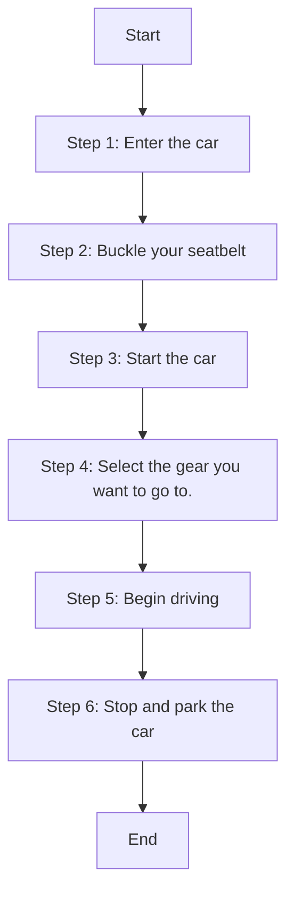

```mermaid
flowchart TD
    Start["Start"] --> EnterCar["Step 1: Enter the car"]
    EnterCar --> Seatbelt["Step 2: Buckle your seatbelt"]
    Seatbelt --> Ignition["Step 3: Start the car"]
    Ignition --> Gear["Step 4: Select the gear you want to go to."]
    Gear --> Drive["Step 5: Begin driving"]
    Drive --> StopCar["Step 6: Stop and park the car"]
    StopCar --> End["End"]
```
### These are steps telling you how to drive a car.
#### Its very important to follow these steps in order to be able to drive a car properly.
